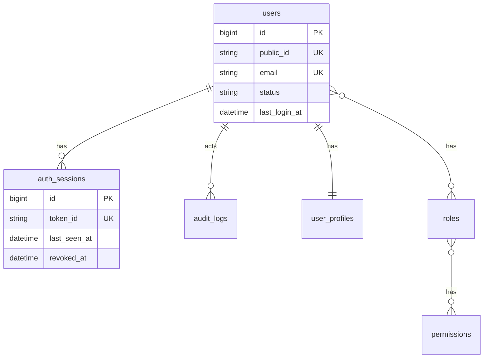

# 📘 Kaan Core Backend — Documentación Completa

> **Versión:** 0.2.0-alpha
> **Stack:** Laravel 12 · PHP 8.2+ · tymon/jwt-auth · spatie/laravel-permission · MySQL
> **Última actualización:** 9 de Marzo de 2026

---

## 📑 Índice

1. [Introducción](#1-introducción)
2. [Requisitos](#2-requisitos)
3. [Instalación](#3-instalación)
4. [Configuración](#4-configuración)
   - 4.1 [Variables de Entorno](#41-variables-de-entorno)
- 4.2 [Feature Flags](#42-feature-flags)
- 4.3 [Links Frontend (Headless)](#43-links-frontend-headless)
5. [Arquitectura del Proyecto](#5-arquitectura-del-proyecto)
- 5.1 [Estructura de Directorios](#51-estructura-de-directorios)
- 5.2 [Patrón de Respuesta API](#52-patrón-de-respuesta-api)
- 5.3 [Manejo Global de Errores](#53-manejo-global-de-erroses)
- 5.4 [Sistema de Rutas Modular](#54-sistema-de-rutas-modular)
6. [Autenticación (JWT)](#6-autenticación-jwt)
- 6.1 [Login](#61-login)
- 6.2 [Refresh](#62-refresh)
- 6.3 [Me](#63-me)
- 6.4 [Logout](#64-logout)
- 6.5 [Gestión de Sesiones (Self-Service)](#65-gestión-de-sesiones-self-service)
7. [Registro Público](#7-registro-público)
8. [Verificación de Email](#8-verificación-de-email)
9. [Security Center Kernel](#9-security-center-kernel)
10. [RBAC — Roles y Permisos](#10-rbac--roles-y-permisos)
11. [Endpoints de la API](#11-endpoints-de-la-api)
12. [Middleware](#12-middleware)
13. [Modelos y Base de Datos](#13-modelos-y-base-de-datos)
14. [Comandos (Install + Pruning)](#14-comandos-install--pruning)
15. [Testing](#15-testing)
16. [Swagger (OpenAPI)](#16-swagger-openapi)
17. [Catálogo de Códigos de Error](#17-catálogo-de-códigos-de-error)
18. [Operaciones (Ops)](#18-operaciones-ops)
19. [Guía de Reutilización](#19-guía-de-reutilización)
20. [Performance Contract](#20-performance-contract)
21. [Feature Matrix](#21-feature-matrix-combinaciones-clave-de-auth)
22. [Roadmap & Backlog](#22-roadmap--backlog-v11--v20)
23. [Flags y Route Cache](#23-flags-y-route-cache)
24. [Convenciones de Desarrollo de Módulos](#24-convenciones-de-desarrollo-de-módulos)
25. [Logging Estructurado (JSON)](#25-logging-estructurado-json)

---

## 1. Introducción

**Kaan Core Backend** es un backend API reutilizable diseñado para servir como base para múltiples proyectos. En lugar de programar autenticación, roles/permisos y seguridad desde cero cada vez, este core provee un **kernel de identidad** profesional y seguro.

Este proyecto mantiene **tres niveles de documentación** obligatorios:

1.  **[Documentación Técnica (Nivel 1)](DOCUMENTATION.md)**: Este documento y [`docs/CONTRACTS.md`](docs/CONTRACTS.md). Contiene la arquitectura, flujos técnicos y contratos de API.
2.  **[Integración Frontend (Nivel 2)](docs/frontend-integration.md)**: Guía específica para que equipos de frontend consuman el core de forma eficiente.
3.  **[Documentación de Producto (Nivel 3)](docs/PRODUCTO.md)**: Visión de alto nivel, beneficios y problemas que resuelve el sistema.

**Filosofía central:**
- ✅ “Todo lo común vive en el Core”
- ✅ “Lo específico se implementa como módulo del proyecto”
- ✅ “Features apagables con flags”

---

## 2. Requisitos

| Requisito | Versión |
|-----------|---------|
| PHP | >= 8.2 |
| Composer | >= 2.0 |
| MySQL | >= 8.0 (SQLite recomendado para tests) |
| Extensiones PHP | `pdo_mysql`, `openssl`, `tokenizer`, `json`, `mbstring`, `dom`, `xml`, `xmlwriter` |

> Nota: `dom/xml/xmlwriter` son necesarias para PHPUnit y algunas herramientas de documentación.

---

## 3. Instalación

```bash
# 1. Clonar el repositorio
git clone <url-del-repo> && cd kaan-core-backend

# 2. Instalar dependencias
composer install

# 3. Configurar entorno
cp .env.example .env
# Editar .env con credenciales de base de datos, mail, etc.

# 4. Generar claves
php artisan key:generate
php artisan jwt:secret

# 5. Instalar el core (migrate + seed + crear admin)
php artisan kaan:install
```

---

## 4. Configuración

### 4.1 Variables de Entorno

#### Aplicación
| Variable | Default | Descripción |
|----------|---------|-------------|
| `APP_ENV` | `local` | `local`, `staging`, `production` |
| `APP_DEBUG` | `true` | Nunca `true` en producción |
| `APP_URL` | `http://localhost` | URL base del backend |

#### JWT
| Variable | Default | Descripción |
|----------|---------|-------------|
| `JWT_SECRET` | | `php artisan jwt:secret` |
| `JWT_TTL` | `60` | TTL en minutos |
| `JWT_REFRESH_TTL` | `20160` | Ventana máxima para refresh (minutos) |

#### Kaan Core (Metadata)
| Variable | Default | Descripción |
|----------|---------|-------------|
| `KAAN_NAME` | `Kaan Core Backend` | Nombre |
| `KAAN_VERSION` | `0.2.0-alpha` | Versión |
| `KAAN_ADMIN_EMAIL` | `admin@kaan.dev` | Email (Bootstrap via `kaan:install`) |
| `KAAN_ADMIN_PASSWORD` | `Secret123456` | Pass inicial por defecto (Bootstrap via `kaan:install`). Requiere min 12 chars, mixed-case, números. **Debe cambiarse inmediatamente en entornos reales.** |
| `KAAN_AUTH_LOGIN_FIELD` | `email` | `email` o `email_or_username` |

#### Paginación Global
| Variable | Default | Descripción |
|----------|---------|-------------|
| `KAAN_PAGINATION_DEFAULT_PER_PAGE` | `15` | Tamaño por defecto de listados paginados |
| `KAAN_PAGINATION_MAX_PER_PAGE` | `100` | Máximo global base (policy runtime puede ajustarlo; hard cap técnico 1000) |

#### CORS
| Variable | Default | Descripción |
|----------|---------|-------------|
| `CORS_ALLOWED_ORIGINS` | `http://localhost:5173` | Orígenes permitidos separados por coma (ej. `https://app.com,https://admin.com`). Nunca dejar el default en producción. |

#### Auth / Registro
| Variable | Default | Descripción |
|----------|---------|-------------|
| `KAAN_AUTH_REQUIRE_VERIFIED_EMAIL` | `false` | Si `true`, bloquea endpoints protegidos por `user.verified` |
| `KAAN_AUTH_VERIFY_EMAIL_EXPIRE_MINUTES` | `60` | Minutos de vigencia del link firmado |
| `KAAN_AUTH_ALLOW_PUBLIC_REGISTRATION` | `false` | Habilita `POST /auth/register` |
| `KAAN_AUTH_REGISTER_ISSUE_TOKEN` | `true` | Emitir token en register (si status=active) |
| `KAAN_AUTH_REGISTRATION_DEFAULT_STATUS` | `active` | `active` recomendado para evitar “dead tokens” |
| `KAAN_AUTH_DEFAULT_ROLE` | `user` | Rol por defecto en registro |
| `KAAN_AUTH_REGISTER_REQUIRE_NAME` | `true` | Obliga `name` en register |

#### Retención / Pruning
| Variable | Default | Descripción |
|----------|---------|-------------|
| `KAAN_AUDIT_RETENTION_DAYS` | *(null)* | Días a retener `audit_logs` (null/0 desactiva prune) |
| `KAAN_SECURITY_SESSIONS_EXPIRED_DAYS` | `7` | Retención sesiones expiradas |
| `KAAN_SECURITY_SESSIONS_REVOKED_DAYS` | `30` | Retención sesiones revocadas |
| `KAAN_SECURITY_LOGIN_ATTEMPTS_RETENTION_DAYS` | `30` | Retención `login_attempts` |
| `KAAN_SECURITY_EXPOSE_RAW_LOGIN` | `false` | Admin ve `login_raw` además de `login_masked` |

---

### 4.2 Feature Flags
Archivo: `config/kaan.php`

#### Core Capabilities (Siempre activas, no desactivables)

| Capacidad | Descripción |
|-----------|-------------|
| **auth_sessions** | Sesiones JWT en DB (revocación inmediata, fail-closed). **Obligatorio.** |
| **rbac** | Roles y permisos (Spatie, guard `api`). Seedeo y asignación siempre activos. **Obligatorio.** |

> ⚠️ **Nota:** `auth_sessions` y `rbac` no aparecen en `config/kaan.php` como feature flags porque son capacidades core no negociables. Siempre están activas.

#### Feature Flags (Toggleables)

| Flag | Default | Tipo | Qué controla |
|------|---------|------|--------------|
| `KAAN_FEATURE_ADMIN` | `true` | Rutas | Registra endpoints de admin (users/roles/perms + módulos dentro) |
| `KAAN_FEATURE_AUDIT` | `true` | Rutas + No-op | Registra `/admin/audit-logs` y activa `AuditLogger` |
| `KAAN_FEATURE_ADMIN_SECURITY` | `true` | Rutas | Registra `/admin/security/*` (login attempts) |
| `KAAN_FEATURE_LOGIN_ATTEMPTS` | `true` | Comportamiento | Registra intentos/bloqueos en DB (login) |
| `KAAN_FEATURE_API_KEYS` | `false` | Rutas | **Módulo 4**: Registra endpoints de API Keys / Service Accounts (M2M) |
| `KAAN_FEATURE_POLICY_CENTER` | `false` | Rutas + Middleware | **Módulo 5**: Registra `/admin/policies` y aplica overrides dinámicos vía middleware |
| `KAAN_FEATURE_APPOINTMENTS` | `false` | Rutas + Seeders | Registra endpoints de citas (self-service y admin) y habilita defaults del modulo |

### 4.3 Paginación

| Variable | Default | Descripción |
|----------|---------|-------------|
| `KAAN_PAGINATION_DEFAULT` | `15` | Items por página por defecto |
| `KAAN_PAGINATION_MAX` | `100` | Máximo permitido de `per_page` (clamped server-side) |

---

### 4.4 Links Frontend (Headless)
| Variable | Descripción |
|----------|-------------|
| `KAAN_FRONTEND_VERIFY_EMAIL_URL` | URL a donde se redirige al verificar email (ej. `https://app.com/verify-email`) |
| `KAAN_FRONTEND_RESET_PASSWORD_URL` | URL del frontend para reset password (ej. `https://app.com/reset-password`) |

---

## 5. Arquitectura del Proyecto

### 5.1 Estructura de Directorios (Resumen)
```
kaan-core-backend/
├── app/
│   ├── Console/Commands/        # kaan:install + pruning
│   ├── Docs/                    # Swagger/OpenAPI
│   ├── Http/
│   │   ├── Controllers/Api/V1/  # Controllers versionados
│   │   ├── Middleware/          # Middleware custom
│   │   ├── Requests/            # Form Requests
│   │   └── Resources/           # API Resources
│   ├── Models/
│   ├── Notifications/
│   ├── Services/
│   └── Traits/
├── config/kaan.php
├── config/kaan_policies.php
├── database/migrations
├── database/seeders
├── routes/
│   ├── api.php
│   └── api/v1/*.php
├── docs/
│   ├── CONTRACTS.md
│   ├── policy-center.md
│   ├── security-center.md
│   └── frontend-integration.md
└── bootstrap/app.php
```

### 5.2 Patrón de Respuesta API
Todas las respuestas siguen el formato del trait `HasApiResponse`:
- **Éxito:** `{ "ok": true, "data": ... }`
- **Error:** `{ "ok": false, "error": { "code": "...", "message": "...", "details": ... } }`

### 5.3 Manejo Global de Errores
| Excepción | HTTP | Error Code |
|-----------|------|------------|
| `ValidationException` | 422 | `VALIDATION_ERROR` |
| `AuthenticationException` | 401 | `AUTH_UNAUTHENTICATED` |
| `ModelNotFoundException` | 404 | `NOT_FOUND` |
| `NotFoundHttpException` | 404 | `RESOURCE_NOT_FOUND` |
| `PolicyNotFoundException` | 404 | `POLICY_NOT_FOUND` |
| `PolicyReadOnlyException` | 403 | `POLICY_READ_ONLY` |
| `PolicyConflictException` | 422 | `POLICY_CONFLICT` |
| `ThrottleRequestsException` | 429 | `RATE_LIMIT_EXCEEDED` |
| Token JWT expirado | 401 | `AUTH_TOKEN_EXPIRED` |
| Token JWT inválido | 401 | `AUTH_TOKEN_INVALID` |
| Token JWT revocado | 401 | `AUTH_TOKEN_REVOKED` |

---

## 6. Autenticación (JWT)

> **Guard por defecto:** El core usa por defecto el guard JWT configurado en `config/auth.php` (`auth.defaults.guard`, que normalmente es `api`). En `.env` se puede sobreescribir mediante `AUTH_GUARD` (por defecto `api`). Esto significa que `auth()` sin guard explícito siempre resuelve al guard configurado (habitualmente el guard JWT/api), no a sesiones web. Por defecto, todos los permisos y roles operan bajo `guard_name = api` (o el guard configurado), salvo que se indique otro guard explícitamente.

> **Catálogo de Permisos:** El endpoint `GET /api/v1/admin/permissions` filtra por `guard_name` usando el guard por defecto configurado en `config('auth.defaults.guard')` (por defecto `api`, configurable vía `AUTH_GUARD`). Se puede sobreescribir pasando explícitamente otro guard, por ejemplo `GET /api/v1/admin/permissions?guard_name=web`. Si el parámetro `guard_name` no se envía o viene vacío, se usa el guard por defecto configurado.

### 6.1 Login
`POST /api/v1/auth/login`
- **RateLimiter**: 5 intentos por minuto por `IP + identifier(HMAC)`.
- **LoginAttempts (DB)**: bloqueo persistente por identifier tras fallos.
- Registra auditoría `auth.login`.

### 6.2 Refresh
`POST /api/v1/auth/refresh`
- Rota el token y la sesión en DB. Invalida el token anterior.

### 6.3 Me
`GET /api/v1/auth/me`
- Retorna datos del usuario, roles y permisos.

### 6.4 Logout
`POST /api/v1/auth/logout`
- Revoca sesión en DB e invalida JWT.

### 6.5 Gestión de Sesiones (Self-Service)
Los usuarios pueden gestionar sus dispositivos en `/api/v1/auth/sessions`:
- `GET /`: Lista sesiones activas.
- `DELETE /{id}`: Cierra sesión en un dispositivo específico (idempotente).
- `POST /revoke-others`: Cierra todo excepto la sesión actual.
- `POST /revoke-all`: Cierra absolutamente todo.

**Revocación Automática (Hardening):**
- Suspender un *Service Account* revoca automáticamente sus API Keys y sesiones activas (kill switch total).
- Revocar una *API Key* revoca instantáneamente las sesiones activas generadas por esa key específica (revocación quirúrgica — no afecta sesiones de otras keys del mismo owner).
- `auth_sessions.api_key_id` vincula cada sesión con la API Key que la generó (solo aplica a sesiones creadas por exchange).

**Modo Verbose (Exchange):**
- Por defecto, las respuestas de error del exchange no distinguen entre key inválida, revocada o expirada (prevención anti-enumeración).
- Activar `KAAN_API_KEYS_EXCHANGE_VERBOSE_ERRORS=true` para obtener códigos específicos (`AUTH_API_KEY_REVOKED`, `AUTH_API_KEY_EXPIRED`).

---

## 7. Registro Público
`POST /api/v1/auth/register` (si habilitado)
- Rate limit dual por IP e Identificador (HMAC del email para no exponer PII en cache).
- **Política de contraseña:** mínimo 12 caracteres, al menos una mayúscula, una minúscula y un número (`Password::min(12)->mixedCase()->numbers()`).
- Guarda metadata en `user_profiles` con allowlist (`phone`, `company`).

---

## 8. Verificación de Email
Link firmado redirige al frontend con parámetros de éxito/error. Soporta modo SPA silencioso mediante `Accept: application/json`.

---

## 9. Security Center Kernel
Módulo de observabilidad y control de seguridad.
- **Admin**: Monitoreo de `login_attempts` con enmascaramiento de PII.
- **Ops**: Comandos de pruning automáticos para limpieza de logs y sesiones.

---

## 10. RBAC — Roles y Permisos
Basado en Spatie Permissions (guard `api`).
- **Roles base**: `admin`, `user`.
- **Permisos**: `admin.users.manage`, `admin.roles.manage`, `admin.permissions.manage`, `admin.audit.view`, `admin.security.view`, `admin.service_accounts.manage`, `admin.api_keys.manage`, `admin.policies.view`, `admin.policies.manage`.

---

## 11. Endpoints de la API

### 11.1 Health
`GET /api/v1/health`
Respuesta diagnóstica del estado del sistema y base de datos.
Incluye `data.policy_center_enabled` y `data.policy_center_degraded` para observabilidad mínima segura del Policy Center.

### 11.2 Auth e Identidad
| Método | Endpoint | Descripción |
|--------|----------|-------------|
| POST | `/api/v1/auth/login` | Login |
| POST | `/api/v1/auth/api-keys/exchange` | Exchange (M2M) API Key por JWT |
| POST | `/api/v1/auth/refresh` | Refresh token |
| POST | `/api/v1/auth/logout` | Logout |
| GET | `/api/v1/auth/me` | Mi perfil |
| GET | `/api/v1/auth/sessions` | Mis sesiones |
| DELETE | `/api/v1/auth/sessions/{id}` | Revocar sesión |

### 11.3 Admin — Usuarios (`admin.users.manage`)

> **Nota:** Los endpoints de `/admin/users` operan exclusivamente sobre usuarios de tipo `human`. Los service accounts se gestionan bajo `/admin/service-accounts/*`.

| Param | Tipo | Descripción |
|-------|------|-------------|
| `q` | string | Busca por nombre/email/username |
| `status` | string | `active`, `suspended`, `pending` |

### 11.4 Admin — Otros Módulos
- **Dashboard**: `/admin/dashboard/summary` Devuelve métricas agregadas (request multiplexing) filtradas por los permisos del usuario actual.
- **Roles/Permisos**: CRUD completo bajo `/admin/roles` y `/admin/permissions`.
- **Audit Logs**: `/admin/audit-logs` (permiso `admin.audit.view`).
- **Security Center**: `/admin/security/login-attempts` (permiso `admin.security.view`).
- **Policy Center**: `/admin/policies` y `/admin/policies/{key}` (permiso `admin.policies.view`), `PATCH /admin/policies` (permiso `admin.policies.manage`).
    - `GET /admin/policies` devuelve header `ETag: W/"policy-v{n}"` para caching/monitoring en frontend.

---

## 12. Middleware

| Alias | Clase | Descripción |
|-------|-------|-------------|
| `jwt.not_revoked` | `EnsureTokenNotRevoked` | **Capa Crítica.** Valida `jti` contra `auth_sessions` en DB (fail-closed). Verifica revocación y expiración. |
| `user.active` | `EnsureUserIsActive` | Bloquea si `user.status !== 'active'`. |
| `user.verified` | `EnsureEmailIsVerified` | Bloquea si el email no está verificado (si config activa). |
| `perm` | `EnsureHasPermission` | Valida permisos RBAC con guard `api`. Devuelve `AUTH_FORBIDDEN` (403) si falla. |
| `auth.register.throttle` | `ThrottlePublicRegistration` | Rate limit dual (IP + email HMAC) en registro público. |
| `throttle:api` | `ThrottleRequests` | **Rate limit global:** 60 req/min por IP. Aplica a todas las rutas `/api/v1/*`. Devuelve `RATE_LIMIT_EXCEEDED` (429) + `Retry-After`. |
| `throttle:admin` | `ThrottleRequests` | **Rate limit admin:** 30 req/min por usuario autenticado. Aplica dentro de cada route file admin, después de `auth:api`. |
| *(global API)* | `AddSecurityHeaders` | Inyecta headers de seguridad HTTP en toda respuesta API: `X-Content-Type-Options`, `X-Frame-Options`, `Referrer-Policy`, `Permissions-Policy`, `Cache-Control`, `Strict-Transport-Security` (solo non-local). |
| *(global API)* | `ApplyPolicyOverrides` | Aplica overrides de Policy Center a `config()` en runtime (no-op si feature desactivada). |

---

## 13. Modelos y Base de Datos

### 13.1 Diagrama Entidad-Relación


---

## 14. Comandos (CLI)
- `kaan:install`: Setup inicial.
- `kaan:audit:prune`: Limpieza de logs.
- `kaan:sessions:prune-expired`: Limpieza de sesiones viejas.
- `kaan:security:prune-login-attempts`: Limpieza de intentos fallidos.
- `kaan:prune-api-keys`: Limpieza de API Keys expiradas/revocadas viejas.

---

## 15. Testing
Ejecución: `php artisan test`. La suite utiliza SQLite en memoria para máxima velocidad.

### 15.1 Gate de Calidad CI (GitHub Actions)

El proyecto incluye un workflow obligatorio (`.github/workflows/ci.yml`) que actúa como gate de calidad.

**Cuándo corre:**
- En cualquier `pull_request` (todas las ramas).
- En `push` directo a `dev` (rama principal de integración).

**Pipeline:**
1. Setup PHP 8.2 + extensiones requeridas.
2. Cache de dependencias Composer.
3. Bootstrap de entorno (`.env.example` → `.env`, `key:generate`, `jwt:secret`).
4. Ejecución de la suite completa de tests (`php artisan test`).
5. Generación de Swagger (`php artisan l5-swagger:generate`).
6. **Check de drift contractual**: verifica que `storage/api-docs/api-docs.json` no tenga cambios no commiteados.

**Qué bloquea un merge:**
- Cualquier test que falle.
- Cualquier cambio en Swagger que no haya sido generado y commiteado previamente (`git diff --exit-code`).

**Relación tests ↔ Swagger ↔ contrato:**
- Los **Contract Tests** (`KernelContract*`) validan las invariantes de `CONTRACTS.md`.
- El **drift check** asegura que el archivo OpenAPI publicado refleje exactamente el código actual.
- Si un cambio modifica endpoints, **debe** regenerar Swagger antes de hacer commit (`php artisan l5-swagger:generate`).

---

## 16. Swagger (OpenAPI)
Generación: `php artisan l5-swagger:generate`.
Visualización: `/api/documentation`.

---

## 17. Catálogo de Códigos de Error

> 📄 **Fuente canónica:** [`docs/CONTRACTS.md`](docs/CONTRACTS.md) — contiene el catálogo completo, reglas de versionado, y política 401 vs 403.

**Quick-reference (códigos más frecuentes):**

| Código | HTTP | Acción del frontend |
|--------|------|---------------------|
| `AUTH_UNAUTHENTICATED` | 401 | Limpiar token → login |
| `AUTH_TOKEN_EXPIRED` | 401 | Intentar refresh → si falla, login |
| `AUTH_TOKEN_REVOKED` | 401 | Sesión cerrada remotamente → login |
| `AUTH_SESSION_NOT_FOUND` | 401 | Fail-closed, limpiar token → login |
| `AUTH_FORBIDDEN` | 403 | Mostrar "Sin permisos" |
| `AUTH_USER_INACTIVE` | 403 | Mostrar "Cuenta suspendida" |
| `VALIDATION_ERROR` | 422 | Mapear `error.details` a inputs |
| `RATE_LIMIT_EXCEEDED` | 429 | Rate limit global/admin → leer `Retry-After`, mostrar countdown |
| `AUTH_TOO_MANY_ATTEMPTS` | 429 | Leer `Retry-After` header, mostrar countdown |
| `NOT_FOUND` | 404 | Recurso no existe (Eloquent) |
| `RESOURCE_NOT_FOUND` | 404 | Ruta no existe |
| `POLICY_CONFLICT` | 422 | Conflicto de reglas cruzadas en policies |
| `POLICY_READ_ONLY` | 403 | Policy de solo lectura |
| `POLICY_NOT_FOUND` | 404 | Policy inexistente |

---

## 18. Operaciones (Ops) y Despliegue

Para llevar el core a **Staging o Producción**, es *obligatorio* cumplir con todas las verificaciones descritas en nuestro checklist maestro:

🛂 **[Checklist de Production Readiness (docs/PRODUCTION-READINESS.md)](docs/PRODUCTION-READINESS.md)**

Temas críticos abordados en la guía operativa:
- Configuración de caché estricta para el **Hearbeat del Scheduler**.
- Requisitos de Colas (Workers) vs modo `sync`.
- Políticas estrictas de contraseñas de inicialización (`kaan:install`).
- Puertas de despliegue usando el comando `php artisan kaan:health --strict`.

---

## 19. Guía de Reutilización

Para arrancar un nuevo proyecto desde Kaan Core, consultar la guía completa:

→ **[docs/GETTING-STARTED.md](docs/GETTING-STARTED.md)**

La guía cubre: modelo de adopción, prerequisitos, configuración del entorno, variables obligatorias y opcionales, feature flags, cómo extender el core, qué no modificar y recursos adicionales.

---

## 20. Performance Contract

### Hot Tables & Índices Mínimos

Todas las tablas de alta frecuencia tienen índices optimizados para queries de pruning y listados ordenados:

| Tabla | Índice | Columnas | Uso principal |
|-------|--------|----------|---------------|
| `auth_sessions` | `idx_user_revoked` | `user_id, revoked_at` | Listar sesiones activas del usuario |
| `auth_sessions` | `idx_user_expires` | `user_id, expires_at` | Listar sesiones por expiración |
| `auth_sessions` | `idx_auth_sessions_expires_at` | `expires_at` | Prune global de sesiones expiradas |
| `auth_sessions` | `idx_auth_sessions_revoked_at` | `revoked_at` | Prune global de sesiones revocadas |
| `auth_sessions` | `idx_auth_sessions_user_last_seen` | `user_id, last_seen_at` | Listado ordenado sin filesort |
| `login_attempts` | `idx_login_attempts_ip` | `ip_address` | Filtro admin por IP |
| `login_attempts` | `idx_login_attempts_status` | `status` | Filtro admin por estado |
| `audit_logs` | `idx_audit_logs_created_at` | `created_at` | Prune global y listados por tiempo |

### Retención / Prune (Obligatorio en producción)

Toda tabla hot **debe** tener un comando de prune programado en el scheduler:
- `kaan:sessions:prune-expired` — sesiones expiradas (`KAAN_SECURITY_SESSIONS_EXPIRED_DAYS`) y revocadas (`KAAN_SECURITY_SESSIONS_REVOKED_DAYS`)
- `kaan:audit:prune` — audit logs (`KAAN_AUDIT_RETENTION_DAYS`)
- `kaan:security:prune-login-attempts` — login attempts (`KAAN_SECURITY_LOGIN_ATTEMPTS_RETENTION_DAYS`)
- `kaan:prune-api-keys` — API keys (`KAAN_API_KEYS_RETENTION_DAYS`)

### Paginación Obligatoria

Todos los endpoints de listado retornan payloads paginados con estructura:
```json
{ "ok": true, "data": { "data": [...], "links": {...}, "meta": {...} } }
```

---

## 21. Feature Matrix (Combinaciones Clave de Auth)

| `require_verified_email` | `register_issue_token` | `registration_default_status` | Comportamiento en Register |
|:---:|:---:|:---:|---|
| `false` | `true` | `active` | Registro inmediato + token. **Experiencia más fluida.** |
| `true` | `true` | `active` | Token emitido pero endpoints protegidos por `user.verified` bloqueados hasta verificar. |
| `true` | `false` | `active` | Sin token hasta verificar email. Registro es solo "cuenta creada". |
| `false` | `true` | `pending` | Token **NO** emitido (status ≠ active). Admin debe activar. |
| `true` | `true` | `pending` | Sin token + email de verificación enviado. Doble gate. |

> **Recomendación alpha:** `require_verified_email=false` + `register_issue_token=true` + `registration_default_status=active`

---

## 22. Roadmap & Backlog (v1.1 / v2.0)

El *Identity Kernel* está diseñado para evolucionar. Las siguientes características han sido identificadas como valiosas para futuras iteraciones empresariales, pero fueron excluidas de la v1.0 por principios de simplicidad:

### Policy Center Avanzado
1. **Readiness Admin endpoint**: Un endpoint autenticado (`/api/v1/admin/readiness`) que exponga `policy_center_last_degraded_seen`, la versión actual del caché y estatus de sincronización completa, sin filtrar valores sensibles.
2. **State Machine (Drafts)**: Soporte para transiciones formales de políticas (Draft → Preview → Published) para organizaciones complejas que requieren pipelines de aprobación.
3. **Validación Cruzada Extensiva**: Integración de validadores coherentes (ej. evitar que el límite de retención de `audit_logs` sea superado por el de `auth_sessions`).
4. **Auditoría Forense de Políticas**: Disparar `AuditLogger` con el evento `policy.updated` durante los requests a `PATCH /admin/policies`, registrando qué llaves fueron alteradas (preservando el blindaje de las `sensitive=true`).
5. **Policy CLI**: Comandos operativos tipo `php artisan kaan:policies:list` o `kaan:policies:set key=value` para administración puramente desde consola.
6. **UI Hints**: Exponer metadata adicional para la construcción de Dashboards (`input: 'toggle'|'number'`, `options`, etc.).

---

## 23. Flags y Route Cache

> ⚠️ **Importante:** Los feature flags que gatean rutas (`KAAN_FEATURE_ADMIN`, `KAAN_FEATURE_ADMIN_SECURITY`, `KAAN_FEATURE_AUDIT`, `KAAN_FEATURE_API_KEYS`, `KAAN_FEATURE_POLICY_CENTER`) se evalúan **al boot**.

Si usas `php artisan route:cache` para producción:
1. Las rutas se compilan una vez y se cachean.
2. Cambiar un feature flag **no** registra/desregistra rutas automáticamente.
3. **Debes regenerar la cache** después de cambiar cualquier flag que afecte rutas:

```bash
php artisan route:clear
php artisan route:cache
```

---

## 24. Convenciones de Desarrollo de Módulos

Para mantener la consistencia del Core, cada nuevo módulo debe seguir estas directrices:

### 24.1 Controllers

- **Traits**: Deben usar `HasApiResponse` para respuestas estandarizadas y `HasPaginationPolicy` para listados.
- **Validación**: Usar obligatoriamente **Form Requests** (`php artisan make:request`) para validar el input antes de entrar al controller.
- **Transformación**: Usar **API Resources** (`php artisan make:resource`) para definir el shape del JSON de salida, asegurando que campos sensibles no se filtren.
- **Envelope**: Todas las respuestas deben retornar vía `$this->success($data)` o `$this->error($code, $message, $status)`.

### 24.2 Capa de Servicios y Lógica

- **Lógica de Negocio**: No debe vivir en el Controller. Extraer acciones complejas a clases de **Service** o **Actions**.
- **Auditoría**: Cada acción administrativa o cambio de estado sensible debe registrarse usando `AuditLogger::log($action, $model, $details)`.
- **Transacciones**: Usar `DB::transaction()` en operaciones que involucren múltiples escrituras (ej. crear usuario + asignar rol).

### 24.3 Testing de Calidad

Cada feature importante debe incluir:
- **Feature Tests**: Validar el flujo completo HTTP.
- **Casos de Éxito**: Validar status 200/201 y shape de `data`.
- **Casos de Error**: Validar 401, 403, 404, 422 y que el `error.code` coincida con el catálogo de contratos.
- **Seguridad**:
    - Probar con usuario sin permisos (403 `AUTH_FORBIDDEN`).
    - Probar con token revocado o sesión expirada (401).
    - Verificar que no se expongan datos sensibles (PII) en Auditoría.

---

## 25. Logging Estructurado (JSON)

Kaan Core incluye un canal de logging estructurado en formato JSON (`json`) diseñado para integrarse con herramientas externas de observabilidad: **ELK Stack, Loki, Datadog** y cualquier sistema que consuma NDJSON.

### 25.1 Configuración

El canal `json` está definido en `config/logging.php`. Usa el driver `monolog` con el `JsonFormatter` nativo de Monolog, que ya viene incluido con Laravel — no se requieren dependencias adicionales.

**Para activarlo como canal por defecto:**

```bash
# Opción A — Canal directo (recomendado para contenedores/cloud)
LOG_CHANNEL=json

# Opción B — Via stack (permite combinar canales)
LOG_CHANNEL=stack
LOG_STACK=json
```

**En desarrollo local** (recomendado):
```bash
LOG_CHANNEL=stack
LOG_STACK=single
```
Esto mantiene logs legibles en texto plano mientras se desarrolla.

### 25.2 Estructura del Mensaje JSON

Cada línea de log producida por el canal `json` tiene la siguiente estructura:

```json
{
  "message": "Descripción del evento",
  "context": {},
  "level": 200,
  "level_name": "INFO",
  "channel": "production",
  "datetime": "2026-03-18T12:00:00.000000+00:00",
  "extra": {}
}
```

**Mapeo a los campos del DoD (Gap 6):**

| Campo DoD | Campo en JSON | Notas |
|-----------|---------------|-------|
| `timestamp` | `datetime` | ISO 8601 con microsegundos |
| `level` | `level_name` | String legible: `INFO`, `ERROR`, `WARNING`, etc. |
| `message` | `message` | Descripción del evento |
| `context` | `context` | Datos adicionales pasados via `Log::info('...', $context)` |

### 25.3 Uso desde el Código

```php
// Log básico
Log::info('Usuario autenticado');

// Log con contexto estructurado (recomendado para producción)
Log::warning('Intento de acceso fallido', [
    'ip' => $request->ip(),
    'identifier' => $maskedIdentifier,
]);

// Log de error con excepción
Log::error('Error al procesar solicitud', [
    'exception' => $e->getMessage(),
    'trace' => $e->getTraceAsString(),
]);
```

### 25.4 Nota sobre AuditLogger

El servicio `AuditLogger` (`app/Services/AuditLogger.php`) escribe directamente en la tabla `audit_logs` de base de datos — no usa la facade `Log::`. Por tanto, **no se ve afectado por el canal de logging** y su comportamiento permanece independiente de esta configuración. Los audit logs continúan siendo accesibles vía `GET /api/v1/admin/audit-logs`.

### 25.5 Integración con Herramientas Externas

El formato JSON por línea (NDJSON) es compatible out-of-the-box con:

- **Filebeat / Logstash (ELK Stack):** apuntar el input `log` al archivo `storage/logs/laravel.log`
- **Promtail (Loki + Grafana):** usar el pipeline stage `json` para parsear `level_name`, `message` y `datetime`
- **Datadog Agent:** usar el parser `json` con el campo `datetime` como timestamp

---
> 💡 **Nota:** Esta documentación es el baseline de referencia para el kernel de identidad. Cualquier modificación estructural al core debe reflejarse aquí.
